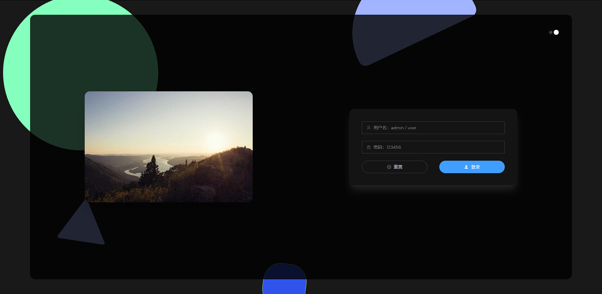
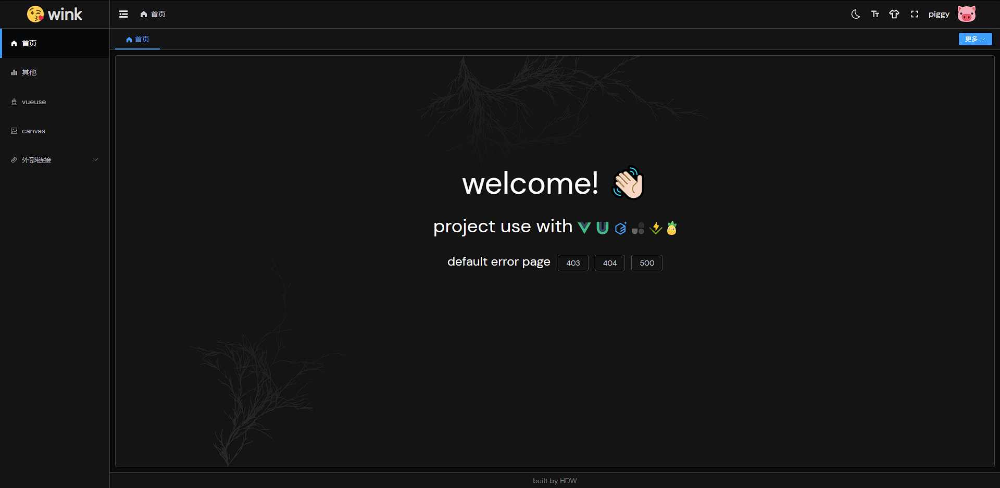

# Vue 3.2 + TypeScript + Pinia + Vite3 + Element-Plus + vueuse + unocss + vitest 管理系统

### 在线预览
link: https://v3-admin.netlify.app/
### 项目前身今世
基于 [vitesse-lite](https://github.com/antfu/vitesse-lite)
复刻 [Geeker-Admin](https://github.com/HalseySpicy/Geeker-Admin)
该后台算是 `Geeker-admin` 的精简版 + vueuse + unocss
把无用的功能删掉出来，只有最干净的架子
包管理使用 `pnpm`，使用 `nr up` 更新依赖（nr 是一个包管理工具名为 [ni](https://github.com/antfu/ni) 的指令）

### 项目技术栈
- **Vue 3.2**
  - 使用 `script setup`、`composition api`
  - 使用 `mitt` 用于事件总线（vue2 的 eventBus）
- **TypeScript**
  - 使用 ts 并开启严格模式
- **Pinia**
  - 使用 `setup store` 抛弃厚重的 ~~vuex~~ 写法 (拜拜了 `mutation`)
- **Vite3**
  - 配置了自动注册、跨域代理、打包分析、gzip压缩
- **vueuse**
  - 自动引入vueuse，多处使用如 `useMagicKeys` `whenever` `useDark` `useToggle` `useCssVar` 等
- **unocss**
  - 整个项目的样式全用 unocss 编写，简洁代码
- **Element-Plus**
  - 无需手动引入，按需加载，支持定制主题和暗黑模式
- **vitest**
  - 支持 vitest 编写测试用例
- **pnpm**
  - 项目的包管理工具

### 项目截图



### TODO:
- 打包优化 <!-- - [项目打包优化实战之-视图分析](https://blog.csdn.net/g18204746769/article/details/127431733) -->
  - 使用按需注册icon，包体积减少200kb
- canvas动图自适应背景

### unocss
如何 import 别的css文件（里面包含unocss的--at-apply）
在 sass 未来版本中会逐步用 `@use` 来代替 `@import`[Introducing Sass Modules](https://css-tricks.com/introducing-sass-modules/)
``` scss
// custom element css
@use './element.scss' as *;
// reset style sheet
@use './reset.scss' as *;
// CSS common style sheet
@use './common.scss' as *;
// css root var
@use './root.scss' as *;

// import element dark theme
@use "element-plus/theme-chalk/src/dark/css-vars.scss" as *;
```

在 `scss` 中使用 `@apply` 会有点问题 [@apply bug issue](https://github.com/unocss/unocss/issues/809)
解决方案：使用 `--at-apply:` 代替 `@apply`
```scss
<style scoped>
[redfoo] {
-  @apply text-red;
+  --at-apply: text-red;
}
[bluefoo] {
-  @apply text-blue;
+  --at-apply: text-blue;
}
</style>
```
```ts
// unocss.config.ts
transformers: [
  transformerDirectives()
]
```

### Pinia
使用 `setup store` 替代 `option store (vuex)` 的写法 [setup-stores](https://pinia.vuejs.org/zh/core-concepts/#setup-stores)
官网话术：
在 _Setup Store_ 中：
- `ref()` 就是 `state`
- `computed()` 就是 `getters`
- `function()` 就是 `actions`

Setup store 比 Option Store 带来了更多的灵活性，因为你可以在一个 store 内创建侦听器，并自由地使用任何组合式函数。==不过，请记住，使用组合式函数会让 SSR 变得更加复杂。==


### Element Plus
主题配置参考
[element-plus-vite-starter](https://github.com/element-plus/element-plus-vite-starter)
[elment plus 自定义主题文档](https://element-plus.gitee.io/zh-CN/guide/theming.html)
**本项目不支持直接在页面配置主题颜色 (意思就是不支持动态配置)**
**支持配置css颜色修改主题色 (暗黑模式和默认模式可使用不同主题色)**
`styles/element/dark.scss` => 修改暗黑主题色配置
`styles/element/index.scss` => 修改默认主题色配置
`styles/element.scss` => 修改全局 element 组件样式
`styles/root.css` => 自定义全局css变量


### 已解决问题
#### 解决 `unplugin-auto-import` 在加载登录页的时候并未注册 `ElMessage` 和 `ElNotification`
确保去掉引入文件(`import xxx from 'element-plus'`) 删除或注释掉手动引入的组件 重启项目就没问题了 [el-plus-auto-import-solution](https://github.com/hdw0504/el-plus-auto-import-solution)

#### 非全局引入el-icon时，解决异步 icon（`<componnent :is="icon" />`）不会自动引入 icon 问题
解决方案1
- 参考官方issue [Dynamic icon components](https://github.com/antfu/unplugin-icons/issues/5)

解决方案2
- `ni -D @iconify/vue` [文档](https://www.npmjs.com/package/@iconify/vue)
- 使用 `<Icon icon="mdi-light:home" />` 他会根据你的 iconname 请求服务获取 svg，然后存储到localstoreage，供下次使用
- 因为为了减少无用icon占用打包容量 (打包后少了200kb) ，没有全局注册 icon 组件。所以当用到 icon 的时候不能直接把icon name直接写到组件的icon属性中（如 `<el-button nicon="Edit" />` 这样子是不支持的），需要手动引入图片icon文件，参考 `pages/login/components/loginForm.vue`
